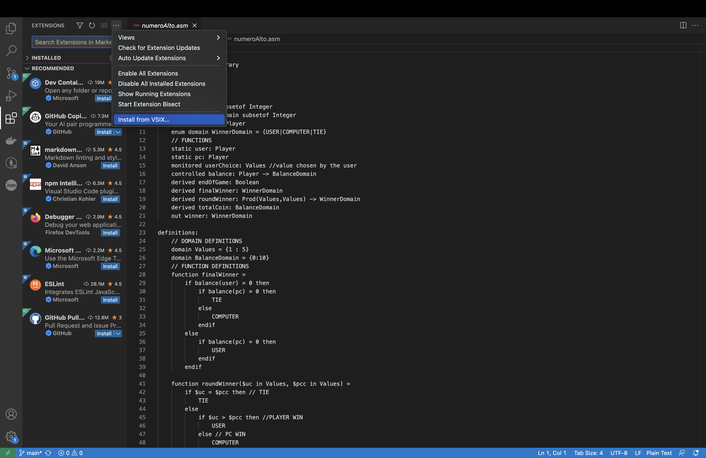

# [W.I.P.]AsmetaCode
Repository for the Visual Studio Code Asmeta extension asmetaVSCE.

## Installation
As the extension is still a work in progress it is not yet published on the Visual Code Extension Marketplace.

You can either download the pre build package `asmetavsce-<major>.<minor>.<patch>.vsix`, or clone the repository and package it yourself.
To import the extension once downloaded or built go to: Extensions > Install from VSIX.

## Contact Information
<li> email: mirco.picca@studenti.unimi.it

## Notes
Please note that this is just a sideproject. As such, it is not regularly updated or worked on.